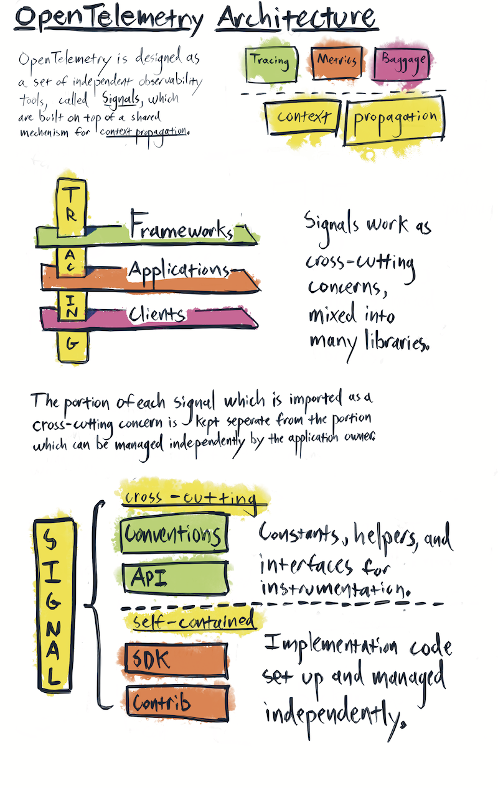
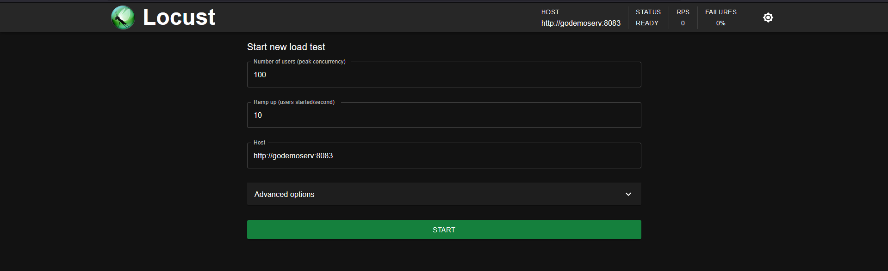
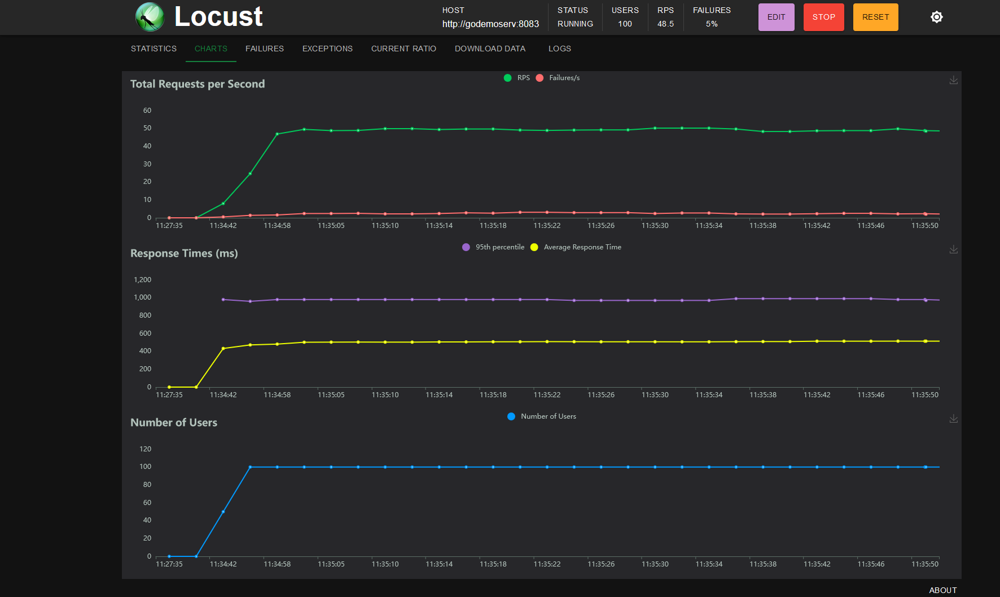
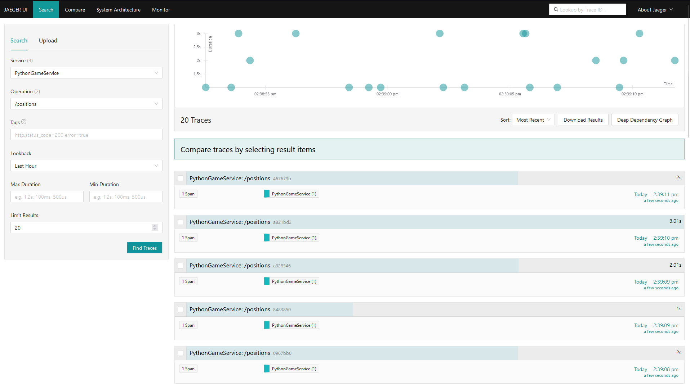
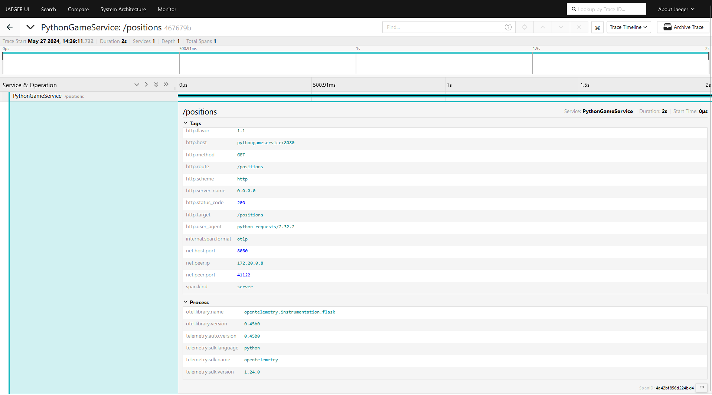
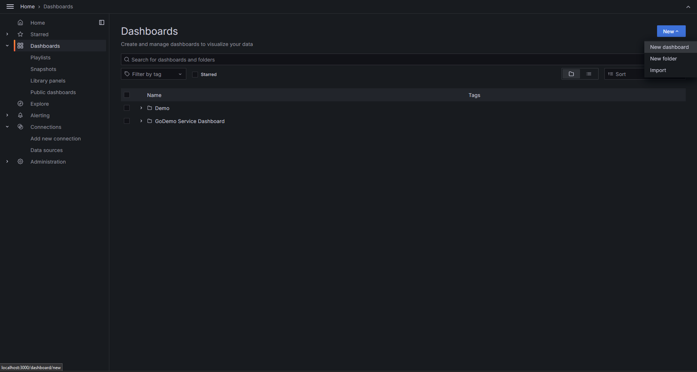
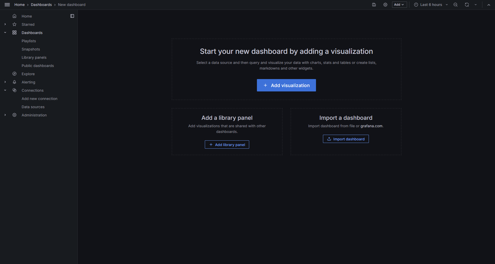
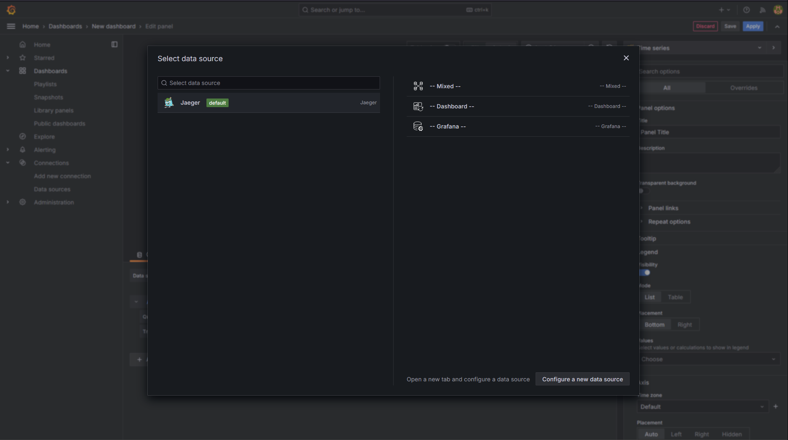
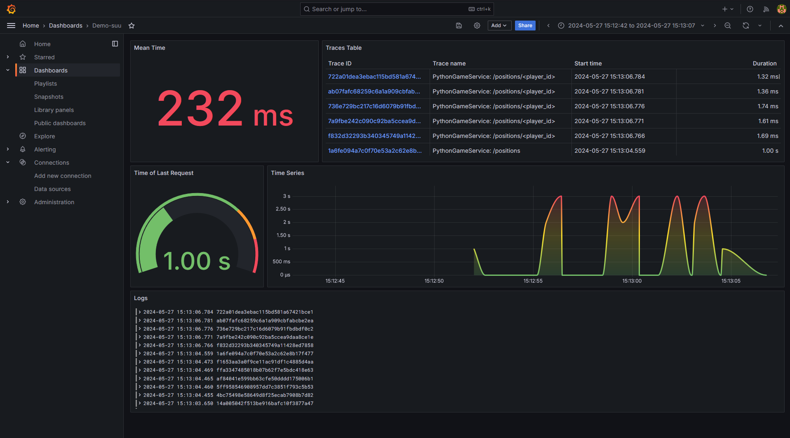

# Internet Technologies - OpenTelemetry

Rafał Tekielski, Szymon Ryś, Karol Wrona

# Overview

This project aims to carry out a simple case study to explore OpenTelemetry. OpenTelemetry is an open-source framework that helps IT teams collect and manage telemetry data, making it easier to monitor and understand systems. By using OpenTelemetry, teams can gain insights into their applications' performance and behavior, identify issues, and improve overall system reliability.

# Introduction to OpenTelemetry

## OpenTelemetry
OpenTelemetry is a modern observability framework and toolkit designed to handle telemetry data like traces, metrics, and logs. It is vendor-neutral, meaning it can integrate with various observability backends, including open-source solutions like Jaeger and Prometheus, as well as commercial products.

Unlike traditional observability tools, OpenTelemetry focuses on the lifecycle of telemetry data—its generation, collection, management, and export. Its main goal is to simplify the process of instrumenting applications or systems, regardless of the language, infrastructure, or runtime environment. OpenTelemetry does not handle the storage and visualization of telemetry data, leaving that to other specialized tools, which allows for greater flexibility.

## High-Level Architecture Overview

*Architecture of framework from OpenTelemetry Docs*

The architecture of OpenTelemetry clients is built around "signals" - distinct types of observability data such as traces, metrics, and baggage. These signals function autonomously yet rely on a shared mechanism for the propagation of context. This setup positions OpenTelemetry as a versatile tool, capable of integrating with different software components to enhance insight into system operations.

OpenTelemetry's design intertwines with other software systems, presenting a unique challenge to the traditional principle of separation of concerns. Crafting OpenTelemetry clients thus demands thoughtful consideration to prevent complications in systems that incorporate it. The design strategically divides API elements, which are integral to cross-cutting functionality, from those elements that can be managed more independently, promoting both flexibility and robustness.

### Key Elements of OpenTelemetry Clients

#### API
The API layer offers the essential interfaces for instrumentation, representing the segment of OpenTelemetry that should be directly engaged by third-party libraries and application codes. This approach ensures the foundational capabilities of OpenTelemetry can be leveraged without necessitating the full SDK.

#### SDK
Serving as the practical implementation of the API, the SDK is under the purview of the application's owner. It encompasses constructors and plugin interfaces, which, unlike the API, are not meant to be cross-cutting and thus are designed for internal use within the application's context.

#### Semantic Conventions
These conventions provide a standardized set of keys and values for consistently describing observed data across various scenarios. Hosted in a dedicated repository, these conventions are intended to be automatically converted into constants, facilitating their application in data collection and analysis.

#### Contrib Packages
This category includes additional tools and integrations with widely-used open-source projects, alongside plugins for exporting telemetry data to different analysis platforms. While some of these tools are essential and thus integrated into the SDK, others are optional and managed separately, offering extended functionality.

### Signals

#### Tracing Signal
Traces give us the big picture of what happens when a request is made to an application. Whether your application is a monolith with a single database or a sophisticated mesh of services, traces are essential to understanding the full “path” a request takes in your application.

They are represented by spans, which are the units of work or operation. In OpenTelemetry, they include the following information:

- Name
- Parent span ID (empty for root spans)
- Start and End Timestamps
- Span Context
- Attributes
- Span Events
- Span Links
- Span Status

#### Metric Signal
OpenTelemetry's metrics system enables the capture of detailed measurements, along with predefined aggregations, allowing for in-depth performance analysis tailored to specific application needs.

#### Log Signal
The log data model specifies the format and meaning of log data and events, enhancing their utility in observability practices.

## The OpenTelemetry Protocol (OTLP)

The OpenTelemetry Protocol (OTLP) serves as a foundational framework for the encoding, transport, and delivery of telemetry data. This includes traces, metrics, and logs from telemetry sources to collectors and ultimately to telemetry backends.

OTLP is structured around a request/response model, facilitating the exchange of telemetry data between clients and servers. This model is implemented over two primary transport mechanisms: gRPC and HTTP 1.1, with Protocol Buffers schema defining the structure of the payloads. The protocol supports two compression options: gzip and none, ensuring efficient data transmission.

The HTTP protocols uses Protobuf payloads encoded either in binary format or in JSON format. Regardless of the encoding the Protobuf schema of the messages is the same for OTLP/HTTP and OTLP/gRPC.

# Case Study Overview

This case study aims to showcase the capabilities of the OpenTelemetry framework in monitoring network traffic and measuring system performance. Utilizing observability backends such as Jaeger and Grafana, we will explore how OpenTelemetry provides visibility into the system's internal operations. Our example involves a simulated environment with two services, that will be generating automated HTTP requests through Locust clients, we will simulate traffic within this system to demonstrate OpenTelemetry's effectiveness in tracking and analyzing system behavior and performance metrics.

The system made for the purpose of this case study consists of:

2 services, which provide simple APIs handling incoming HTTP requests:

- Go service = http://localhost:8083
- Python service = http://localhost:8080

Services are instantiated and configured as Docker containers within a Docker Compose setup to be able to communicate with the system.  Both services are flooded with HTTP requests created by two Locust clients, which simulates network traffic within the application. Docker Compose are also responsible for connecting generated metrics with observability backends, to display them in the user-friendly form. Those backends are Jaeger and Grafana.

# Demo Setup

## Running docker compose

To run all neccessary services just use:

> docker-compose up

## Configuring Locust

To configure the Locust services go to:
- localhost:8089 (pyhtongameservice)
- localhost:8084 (godemoserv)

Then configure *Number of users* and *Ramp Up*.

*Locust UI*

*Locust Running Tests*

## Jaeger Configuration

Go to Jaeger UI: localhost:16686

On the left panel select service, and all operations. After that you can observe the traces send by OTel Collector

*Jaeger UI*

*Jaeger Trace View*

## Grafana Configuration

Go to Grafana UI: localhost:3000

and login with credentials:
- username: admin
- password: admin

Grafana will ask to change the default password, you can skip this step

Go to *Dashboard* section on the left panel and click *New* button.

Then click *Add visualization*:

Choose Jaeger as the database:

Then on the botton panel you can select *Search* as *Query Type*, and choose service and operation name:

Then you can start creating panels.

## Example Graphana panel

Here we present a demonstration panel, with configuration stored in a JSON file: *example.json*. This panel showcases crucial data including the average time per request, request graph, a trace table, and an associated log table for these traces. Additionally, we display the duration of the last request made.

*Grafana Panel*